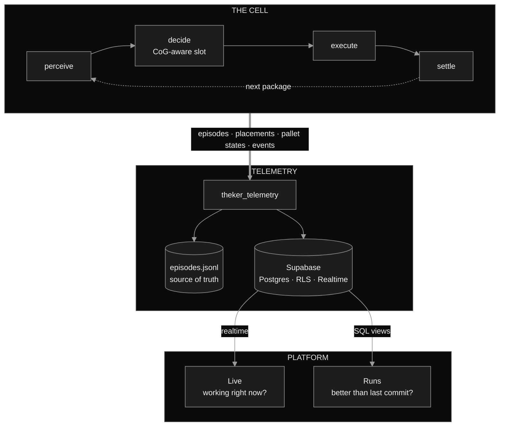

<div align="center">


**A robotic arm that stacks pallets without tipping them over — and the instrumentation that proves it.**

`THEKER Robotics challenge` · `HackSpain '26` · `MuJoCo` · `Supabase` · `Next.js`

</div>

---

A palletizing cell: the arm sees the packages, decides where each one goes, places it, and
watches the stack settle. The placement is not first-come-first-served — a heuristic scores
every candidate slot by **dimensions, mass and the center of gravity it leaves behind**, so
the finished pallet survives being lifted and moved.

Around it runs an observability platform. Every episode, every placement and every shift of
the center of gravity is recorded, from a scripted simulation of the arm building a pallet to
the full traceability of the real system and how it improves commit after commit.

## The task, in the order it happens

| Phase | What the system produces | What you can see |
|---|---|---|
| **Perceive** | RGB-D image → detected packages: pose, dimensions, class | the frame with boxes drawn on it, the confidence, how many it saw vs how many were there |
| **Decide** | package → slot assignment: layer, position, yaw | the stacking plan, and whether the package ended up in the planned slot or another one |
| **Execute** | arm trajectory → package released | the real error against the slot, in mm and degrees |
| **Settle** | physics: does the stack move? | drift after release, resulting CoG, stability margin |

Perception only ever sees rendered images, never the simulator state. The `--oracle` flag
replaces it with ground-truth poses to measure the ceiling — and anything produced with it is
flagged loudly and never compared against measured data.

## Why the center of gravity

A pallet that is full is not a pallet that is good. What decides whether the load survives the
forklift is where the combined center of gravity sits relative to the support polygon of the
stack — and that is a number that moves with every single box:

```
stability_margin  =  distance from the CoG to the nearest edge of the support polygon
                     negative  ->  it tips over
```

The planner keeps that margin positive while still filling the pallet, and the platform draws
the margin shrinking box by box. In an episode that ends in collapse, you can see it coming
several placements early.

## Architecture



The dependency runs one way only. The simulators import the telemetry SDK; the platform does
not know MuJoCo exists, so rewriting the simulation never takes the observability down with
it. Supabase **is** the backend — PostgREST, RLS and Realtime, no server of our own in
between. The `jsonl` on disk stays the source of truth: if the venue wifi dies mid-demo, the
benchmark keeps running.

## Two screens

**Live** — mission control. The pallet building up layer by layer, top view and elevation,
with the CoG cross moving inside the support polygon. Four KPIs readable from three metres
away and an event feed that makes the system feel alive. It never goes blank: with no active
run it shows the last finished episode, and if the connection drops it freezes the last frame
and says so.

```
┌───────────────────────────────┬──────────────────────────────────┐
│ ● LIVE  palletizing · lvl 2 · seed 37 · 8c5cbf4 · x4             │
├───────────────────────────────┼──────────────────────────────────┤
│                               │  PLACED       7 / 10             │
│         TOP VIEW              │  CYCLE        4.2 s              │
│      pallet + slots           │  STABILITY   +31 mm              │
│       + CoG cross             │  FILL          68 %              │
│                               ├──────────────────────────────────┤
├───────────────────────────────┤  12.4s  ✓ placed     box_03      │
│         ELEVATION             │  11.8s  ↓ picked     box_03      │
│      stacked layers           │  11.1s  ◎ planned    layer 2     │
│       + CoG height            │  10.9s  ◉ perceived  4 packages  │
└───────────────────────────────┴──────────────────────────────────┘
```

**Runs** — engineering. Every execution with its commit, level, seed range and arm speed, a
success sparkline per episode, the failure breakdown, and a comparator between two commits.
When two runs do not measure the same thing — different level, different seeds, one with
oracle — the comparison is **blocked** rather than rendered. A pretty chart built on an
invalid delta is exactly what a demo should not produce.

<!-- gifs: https://raw.githubusercontent.com/STACKSPECT/.github/main/img/live.gif · runs.gif -->

## What we measure

| Metric | Unit | Definition |
|---|---|---|
| `stability_margin` | mm | CoG to the nearest edge of the support polygon. **Negative = it tips over** |
| `cog_offset_xy` | mm | CoG of the load to the center of the pallet |
| `support_ratio` | 0–1 | fraction of the package base resting on something solid |
| `overhang` | mm | how far the most protruding package sticks out of the pallet |
| `fill_ratio` | 0–1 | occupied volume over the bounding volume of the load |
| `settle_drift` | mm | how much the stack moved between release and rest |
| `cycle_time_s` | s | `duration_s / n_placed` — the number a real plant understands |

Failures come from a closed vocabulary, and the interface never shows the raw identifier:

| enum | on screen |
|---|---|
| `no_detection` | it saw no package |
| `ik_unreachable` | it cannot reach the position |
| `collision` | it hit something |
| `grasp_slip` | it slipped out of the gripper |
| `wrong_placement` | it left it out of tolerance |
| `timeout` | it ran out of time |
| `stack_collapse` | the stack collapsed |
| `overhang_violation` | it left the package off the pallet |

## Measured, not claimed

Baseline from the induction task that preceded palletizing — level 2, 40 episodes, seeds
200–239. Same instrumentation, same tables, now carried over to the pallet:

| Arm speed | Episode success | Packages placed | Mean time | Dominant failure |
|---|---:|---:|---:|---|
| x1 | 82 % | 113/120 · 94 % | 0.79 s | `wrong_placement` |
| x4 | 88 % | 112/120 · 93 % | **0.54 s** | `grasp_slip` |

Running the arm four times faster cut a third off the cycle at no measurable cost in placement
rate — which is not what you would expect. What changed is **why** it fails: at x1 the problem
is releasing the package badly oriented, at x4 the package starts escaping the gripper. That
distinction is the entire point of instrumenting before optimizing.

## Repositories

| Repo | What lives there |
|---|---|
| [**Platform**](https://github.com/STACKSPECT/Platform) | Observability platform — Supabase schema, `theker_telemetry` SDK, Next.js interface |
| [**Simulation**](https://github.com/STACKSPECT/Simulation) | MuJoCo physics, perception, CoG-aware layer planner, arm control |
| [**Guionized-Simulation**](https://github.com/STACKSPECT/Guionized-Simulation) | Scripted pallet build, feeding the same telemetry contract |

## Stack

Python 3.11 · MuJoCo · Supabase (Postgres · RLS · Realtime) · Next.js 16 · TypeScript ·
pytest. SI units in the database, millimetres and degrees on screen, and the unit is always
printed next to the number.

---

<div align="center">

<sub>Built for the <b>THEKER Robotics</b> challenge at <b>HackSpain '26</b> by
<a href="https://github.com/manuamest">José Manuel Amestoy</a>
<!-- add the rest of the team here --></sub>

<sub><a href="https://github.com/STACKSPECT/.github/blob/main/LICENSE">MIT License</a></sub>

</div>
