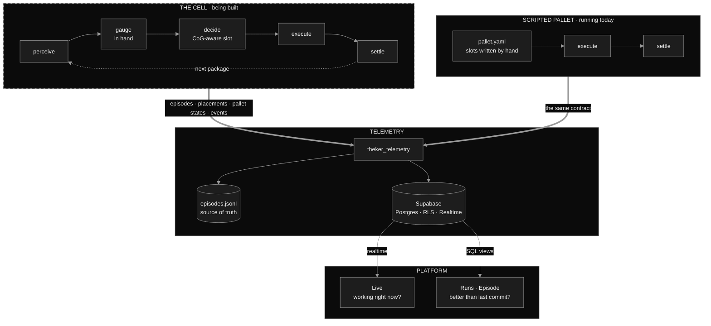

<div align="center">


**A robotic arm that stacks pallets without tipping them over — and the instrumentation that proves it.**

`THEKER Robotics challenge` · `HackSpain '26` · `MuJoCo` · `Supabase` · `Next.js`

</div>

---

A palletizing cell: the arm sees the packages, decides where each one goes, places it, and
watches the stack settle. The placement is not first-come-first-served — a heuristic scores
every candidate slot by **dimensions, mass and the center of gravity it leaves behind**, so
the finished pallet survives being lifted and moved.

Around it runs an observability platform. Every episode, every placement and every shift of
the center of gravity is recorded, from a scripted simulation of the arm building a pallet to
the full traceability of the real system and how it improves commit after commit.

**That cell is under construction.** What runs today is the platform, fed with real
palletizing episodes by a scripted simulation where the physics and every measurement are
real and only the choice of slot is written by hand. The table below says which is which, and
the rest of this page keeps the two apart.

## The three repositories

| Repo | What lives there | Where it is |
|---|---|---|
| [**Simulation**](https://github.com/STACKSPECT/Simulation) | **The real cell, and the bulk of the project.** A conveyor stops, the arm picks the package, measures it *in hand*, and only then chooses a slot. Perception, gauge, CoG-aware planner, MuJoCo. | 🏗 **Skeleton.** The contracts are fixed and the architecture is written down; `src/contracts.py` and `scripts/setup.sh` are the only working code, and [the arm has not been chosen yet](https://github.com/STACKSPECT/Simulation#open-decisions). [Per-file status](https://github.com/STACKSPECT/Simulation#per-file-status). |
| [**Platform**](https://github.com/STACKSPECT/Platform) | Observability — Supabase schema, the `theker_telemetry` SDK, and a Next.js interface with three screens. | ✅ **Running**, on real measured episodes. |
| [**Guionized-simulation**](https://github.com/STACKSPECT/Guionized-simulation) | Scripted pallet build in MuJoCo with a Franka Emika Panda. The slot assignment comes out of a YAML file; the physics does not. | ✅ **Running.** 10 of 10 boxes placed, [measured below](#measured-not-claimed). |

The scripted build exists so the platform receives genuine palletizing episodes before
anything can produce them for the right reasons. It is deliberately the small piece: the plan
is a solved puzzle, there is no perception and nothing that can get a choice wrong. **The
work is `Simulation`** — and when it runs, it replaces the script and touches nothing else on
this page.

## The task, in the order it happens

This is the cell being built in `Simulation`.

| Phase | What the system produces | What you can see |
|---|---|---|
| **Perceive** | RGB-D image → detected packages: pose, approximate dimensions, class | the frame with boxes drawn on it, the confidence, how many it saw vs how many there were |
| **Gauge** | the package **already in the gripper** → dimensions, mass, CoG offset | what it thought it had picked up against what it actually had |
| **Decide** | package → slot assignment: layer, position, yaw | the stacking plan, and whether the package ended up in the planned slot or another one |
| **Execute** | arm trajectory → package released | the real error against the slot, in mm and degrees |
| **Settle** | physics: does the stack move? | drift after release, resulting CoG, stability margin |

The order matters more than it looks. Measuring **after** the pick and **before** the plan is
what forces the planner to be incremental: it cannot lay out the whole pallet in advance,
because it does not know what the next package is until the arm is holding it.

Perception will only ever see rendered images, never the simulator state. Each stage ships an
oracle stub that reads ground truth instead — `OracleDetector`, `OracleGauge`, `GridPlanner` —
so the loop can run end to end before any of them is real. A run is flagged `oracle` if **any**
stub was in the loop, and the platform never compares an oracle run against a measured one.
Every episode on this page is an oracle run: the scripted build is a solved puzzle, so the
badge is on.

## Why the center of gravity

A pallet that is full is not a pallet that is good. What decides whether the load survives the
forklift is where the combined center of gravity sits relative to the support polygon of the
stack — and that is a number that moves with every single box:

```
stability_margin  =  distance from the CoG to the nearest edge of the support polygon
                     negative  ->  it tips over
```

The planner keeps that margin positive while still filling the pallet, and the platform draws
the margin shrinking box by box. In an episode that ends in collapse, you can see it coming
several placements early.

## Architecture



The dependency runs one way only. The simulators import the telemetry SDK; the platform does
not know MuJoCo exists, so rewriting the simulation never takes the observability down with
it. Both producers speak the same contract, which is the whole reason the scripted build is
worth having: the platform is already exercised against the shape of data the real cell will
send. Supabase **is** the backend — PostgREST, RLS and Realtime, no server of our own in
between. The `jsonl` on disk stays the source of truth: if the venue wifi dies mid-demo, the
benchmark keeps running.

## Three screens

The same pallet drawing everywhere; what changes is which episode it is pointed at.

**Episode** — one finished run, taken apart. Top view with the support polygon and the CoG
marker, elevation drawn to the real pallet size, the KPI grid, and an event feed carrying the
error of every placement in mm and degrees. Note the **Oracle** badge next to the commit.

<picture>
  <source media="(prefers-color-scheme: dark)" srcset="https://raw.githubusercontent.com/STACKSPECT/.github/main/img/episode-dark.png">
  
</picture>

**Runs** — engineering. Every execution with its commit, level, seed range and arm speed, a
success sparkline per episode, the dominant failure cause, and a comparator between two
commits. When two runs do not measure the same thing — different task or level, different
seeds, one with oracle, one seeded — the comparison is **blocked** rather than rendered, and
the panel says which of the four conditions tripped. A pretty chart built on an invalid delta
is exactly what a demo should not produce.

<picture>
  <source media="(prefers-color-scheme: dark)" srcset="https://raw.githubusercontent.com/STACKSPECT/.github/main/img/runs-dark.png">
  
</picture>

**Live** — the same dashboard, following the episode that is running now, with four KPIs
readable from three metres away and an event feed that makes the system feel alive. It never
goes blank and it never lies about what it is showing: with nothing running it says so rather
than backfilling the last finished episode, and if the connection drops it freezes the last
frame it received and says that too.

<sub>Captured at 1440 px from real runs; both screens follow your theme, and so do the images.
The interface is in Spanish.</sub>

## What we measure

| Metric | Unit | Definition |
|---|---|---|
| `stability_margin` | mm | CoG to the nearest edge of the support polygon. **Negative = it tips over** |
| `cog_offset_xy` | mm | CoG of the load to the center of the pallet |
| `support_ratio` | 0–1 | fraction of the package base resting on something solid |
| `overhang` | mm | how far the most protruding package sticks out of the pallet |
| `fill_ratio` | 0–1 | occupied volume over the bounding volume of the load |
| `settle_drift` | mm | how much the stack moved between release and rest |
| `cycle_time_s` | s | `duration_s / n_placed` — the number a real plant understands |

Failures come from a closed vocabulary, and the interface never shows the raw identifier:

| enum | on screen |
|---|---|
| `no_detection` | it saw no package |
| `ik_unreachable` | it cannot reach the position |
| `collision` | it hit something |
| `grasp_slip` | it slipped out of the gripper |
| `wrong_placement` | it left it out of tolerance |
| `timeout` | it ran out of time |
| `stack_collapse` | the stack collapsed |
| `overhang_violation` | it left the package off the pallet |

## Measured, not claimed

<div align="center">

</div>

A scripted palletizing run — 10 boxes, 2 layers, a 210 × 140 mm pallet, which is a 1:5.7 model
of a Euro pallet because the Panda's gripper opens 80 mm and a real pallet is ungraspable.
**No planner earned this plan**: which box goes where is written out in
[`configs/pallet.yaml`](https://github.com/STACKSPECT/Guionized-simulation/blob/main/configs/pallet.yaml).
Everything below was measured off the simulator's real state.

| | |
|---|---:|
| Placed | 10 / 10 |
| Placement error, mean · max | 2.6 mm · 5.7 mm |
| Flatness of the top layer | 0.1 mm |
| Maximum overhang | 0.2 mm |
| CoG to the pallet centre | 2.2 mm |
| Stability margin at the end | **+58 mm** |
| Pallet fill | 77 % |
| Duration | 204 s simulated |

Repeatable: the script is fixed, MuJoCo is deterministic and the dependencies are pinned, so
the same seed gives the same pallet. That is what makes two commits comparable — and it is the
floor the real planner has to clear, on a puzzle that was solved by hand, off-line, knowing
every box in advance. The planner will not have any of that.

The number that took longest to find is not in the table: the arm runs at **0.0625 m/s**, a
quarter of its nominal Cartesian speed. Above it the box slips in the gripper and lands 15–20
mm off — and it is the segment's acceleration that does it, not the payload, which was tested
from 0.03 to 0.13 kg with the same slip. Every calibration figure the project has is a Franka
Panda measurement like that one, which is why choosing a different arm means
[re-measuring all of them](https://github.com/STACKSPECT/Simulation#open-decisions) rather
than copying them across — and why the arm is the decision that gates the rest.

## Stack

Python 3.11+ · MuJoCo · Supabase (Postgres · RLS · Realtime) · Next.js 16 · TypeScript ·
pytest. SI units in the database, millimetres and degrees on screen, and the unit is always
printed next to the number.

---

<div align="center">

<sub>Built for the <b>THEKER Robotics</b> challenge at <b>HackSpain '26</b> by
<a href="https://github.com/manuamest">José Manuel Amestoy</a>
<!-- add the rest of the team here --></sub>

<sub>MIT throughout —
<a href="https://github.com/STACKSPECT/.github/blob/main/LICENSE">this repository</a> ·
<a href="https://github.com/STACKSPECT/Simulation/blob/main/LICENSE">Simulation</a> ·
<a href="https://github.com/STACKSPECT/Platform/blob/dev/LICENSE">Platform</a> ·
<a href="https://github.com/STACKSPECT/Guionized-simulation/blob/dev/LICENSE">Guionized-simulation</a></sub>

</div>
