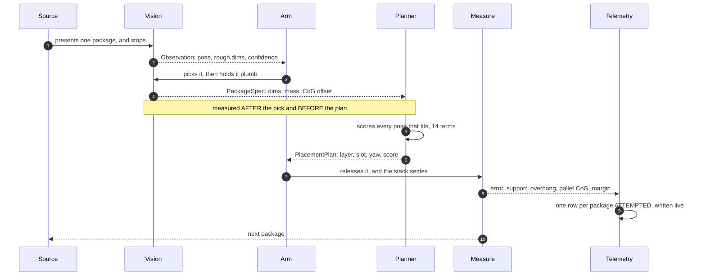
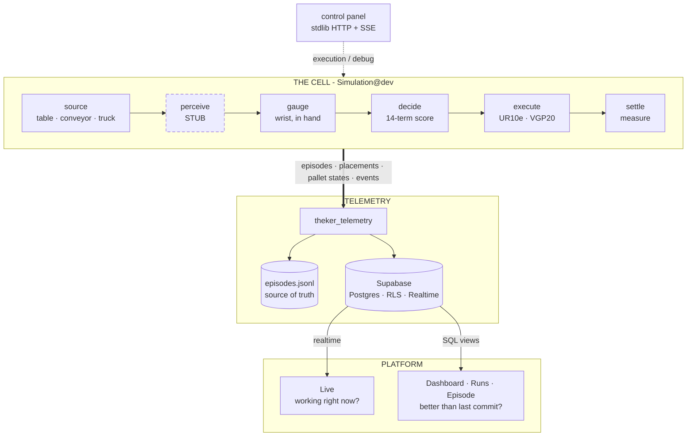

<div align="center">


**A robotic arm that stacks pallets without tipping them over — and the instrumentation that proves it.**

[](https://github.com/STACKSPECT/.github/blob/main/LICENSE)
[](https://github.com/STACKSPECT/Platform/actions/workflows/ci.yml)
[](https://mujoco.org)
[](https://www.python.org)
[](https://supabase.com)
[](https://nextjs.org)

`THEKER Robotics challenge` · `HackSpain '26`


</div>

---

A palletizing cell that closes the loop. The arm sees the package a source presents, picks
it, **weighs it in its own wrist**, and only then decides where it goes — a heuristic that
scores every pose that fits by support, by the air it would trap and by where it leaves the
combined centre of gravity. Then it places it and watches the stack settle.

Around it runs an observability platform. Every episode, every placement and every shift of
the centre of gravity is recorded, so that the question *"is this commit better than the last
one?"* has an answer that is a number.

**The cell runs.** A UR10e picks from a table, a moving conveyor or a truck trailer across
nine selectable levels, the placement heuristic is the real one, and the pallet is a full
1200 × 800 mm europallet. What is **not** yet real is perception: the detector that says
*what is in front of me* is still a stub that reads the simulator's ground truth. The table
below says exactly which pieces are which, and the rest of this page keeps them apart.

> The work is on **[`Simulation@dev`](https://github.com/STACKSPECT/Simulation/tree/dev)**.
> That repository's `main` branch is still the earlier skeleton, so the links to it below
> point at `dev`, where the 107 files live.

## The three repositories

| Repo | What lives there | Where it is |
|---|---|---|
| [**Simulation**](https://github.com/STACKSPECT/Simulation/tree/dev) | **The real cell, and the bulk of the project.** A source presents a package, the arm picks it, measures it *in hand*, and only then chooses a slot. UR10e + suction, three sources, CoG-aware planner, depth-camera pallet survey, MuJoCo. | 🟢 **Closed loop, running.** 223 checks green, and [147 of 165 packages placed](#measured-not-claimed) across 27 episodes. **Perception is the one stub left.** |
| [**Platform**](https://github.com/STACKSPECT/Platform) | Observability — Supabase schema, the `theker_telemetry` SDK, and a Next.js interface with four screens. | 🟢 **Running**, on real measured episodes. 101 backend checks green. |
| [**Guionized-simulation**](https://github.com/STACKSPECT/Guionized-simulation) | The predecessor: a scripted pallet build in MuJoCo with a Franka Emika Panda. The slot assignment comes out of a YAML file; the physics does not. | 🟢 **Done, and superseded.** It fixed the contract with the platform. [Its numbers are below](#the-baseline-it-had-to-clear). |

The scripted build existed so the platform received genuine palletizing episodes before
anything could produce them for the right reasons. It did its job: `Simulation` now sends the
same rows for the right reasons, and the platform did not have to change to receive them.

<table>
<tr>
<td width="50%" align="center">

<br><sub><b>Then.</b> A Panda, a 210 × 140 mm model pallet, and a plan written by hand in YAML.</sub>
</td>
<td width="50%" align="center">

<br><sub><b>Now.</b> A UR10e, a full europallet, and a plan nobody wrote down in advance.</sub>
</td>
</tr>
</table>

## The cycle, in the order it happens



The order matters more than it looks. Measuring **after** the pick and **before** the plan is
what forces the planner to be incremental: it cannot lay out the whole pallet in advance,
because it does not know what the next package is until the arm is holding it.

## What is real, and what is still a stub

Every stage shipped an oracle stub that reads the simulator's ground truth, so the loop could
run end to end before any stage was real. Three of the four have since been replaced. A run is
flagged `oracle` if **any** stub is still in the loop — and because perception has not been
written, every run today is still flagged, honestly.

| Stage | Stub | Implementation | State |
|---|---|---|---|
| **Perceive** | `OracleDetector` | `CameraDetector` | ⬜ **Not written.** `observe()` raises `NotImplementedError`; the approach is undecided. This is what keeps `oracle` true. |
| **Gauge** | `OracleGauge` | `WristGauge` | ✅ **Real.** Force/torque at the wrist, one plumb reading. `--no-oracle-gauge` |
| **Pallet survey** | ground truth | three depth cameras | ✅ **Real.** Renders depth, unprojects, fuses. `--no-oracle-heightmap` |
| **Decide** | `GridPlanner` | `ScorePlanner` | ✅ **Real, and the default.** `BeamPlanner` and the grid baseline stay for comparison. |

`oracle` is computed in one place, from which pieces were selected — never written by hand.
The platform refuses to compare an oracle run against a measured one, because that is exactly
the comparison that would invalidate the work.

## The cell

**Universal Robots UR10e** on a pedestal with an **OnRobot VGP20** 16-cup vacuum gripper.
1300 mm reach, 12.5 kg payload; the tool weighs 2.55 kg, which puts the ceiling on a carton at
**8.5 kg** with 1.45 kg to spare. The arm model comes from MuJoCo Menagerie; the kinematic
chain is assembled in the repo rather than included wholesale, so the cell can be an
industrial bay with a pallet, a fence and a trailer instead of Menagerie's empty floor.

Three sources, three tiers each — **nine levels**, declared in YAML, not in code:

| Source | What it does | Levels |
|---|---|---|
| **Table** | Packages sit ready. Nothing moves until the arm does. | one type aligned · mixed and rotated · sorted, adversarial CoG |
| **Conveyor** | A physical belt runs the package to the station and stops. *Stopped* means measured rest, not a fixed wait. | centred on the belt · off-centre arrival · variable spacing |
| **Truck** | The trailer hands over the **whole load at once**. The only carton the arm may take is the one holding nothing up — and that order is recomputed each cycle by measuring the scene, not read from the loading plan. | tidy columns · with the loader's mess · sorted, adversarial CoG |

A jam is reported as `timeout`, never as a source-specific failure: the event vocabulary is
closed and a source has no event of its own. Getting that wrong rejects the row and silently
kills telemetry for the rest of the run — which is why it is written down.

## The control panel

<div align="center">

</div>

Pick a level, press play, watch it in the MuJoCo window. The transport bar pauses the cell and
steps back through what already happened; the speed presets and the centre-of-mass markers
stay live while it runs. Two markers, deliberately: **the real centres of mass MuJoCo
integrates, and the ones the robot computed** — with the error drawn between them in yellow.

The mode selector is the part that matters. **Execution** calls the real entrypoint and may
publish telemetry. **Debug** calls the local runner and says on its own badge that it opens no
episode and uploads nothing. A demo that quietly writes to the production database is a demo
that poisons the benchmark it is meant to show.

The whole server is Python standard library — no framework, no bundler, nothing fetched at
start-up — so it still works on a laptop with the wifi switched off.

## Measured, not claimed

Nine levels × three seeds, on `Simulation@dev` at `ebad291`, the real `ScorePlanner`,
`--no-telemetry`, everything below measured off the simulator's own state.

Two columns because the arm has two honest modes, and conflating them would flatter it. In
fast-forward the arm jumps between waypoints — the release, the settling and the shake are
simulated exactly the same, but the transit is not. With motion interpolated, every
millimetre of the trajectory is integrated.

| | fast-forward | motion interpolated |
|---|---|---|
| | `--level N -n 3` | `--level N -n 3 --speed 1` |
| Episodes completed | **22 / 27** | 14 / 27 |
| Packages placed | **147 / 165** · 89 % | 108 / 165 · 65 % |
| Placement error — mean · p95 · max | 2.5 · 4.1 · 12.8 mm | 2.6 · 4.2 · **6.1 mm** |
| Placements resting fully supported | 77 % | 72 % |
| Stability margin, worst case | **+53 mm** | **+53 mm** |
| Margin ever negative | never | never |
| Dominant failure | `ik_unreachable`, `wrong_placement` | **`stack_collapse`** — 9 of 13 |

Read the last two rows together, because they are the finding. **The planner's aim does not
degrade when the motion becomes real — 2.5 mm against 2.6 mm — but the stacks start falling
over.** What real transit costs is not accuracy, it is everything the arm disturbs on the way
past. That is an execution problem, and it is where the tuning is happening: the cell's
Cartesian speeds were already halved, and measured, for exactly this reason.

By tier, the shape is what you would want it to be — the easy levels are solved and the hard
ones are the frontier:

| | N1 — one type, aligned | N2 — mixed, rotated | N3 — sorted, adversarial CoG |
|---|:--:|:--:|:--:|
| fast-forward | 9 / 9 | 8 / 9 | 5 / 9 |
| motion interpolated | 7 / 9 | 4 / 9 | 3 / 9 |

Every failure came out of the closed vocabulary below. Not one run invented a cause.

### The planner earns its keep

Against a first-fit baseline, ten permutations of the reference scenario, seed 17 — both place
every package, so completion is not the interesting number:

| | first-fit | this planner |
|---|---:|---:|
| Stacks that are strictly stable | 50 % | **100 %** |
| Mean CoM offset from the pallet centre | 142 mm | **81 mm** |

And the weights are the knobs, not the code. Sweeping the one that pulls the stack's centre of
gravity toward the middle of the pallet, on level 11:

| `pallet_com` | CoG offset | width used | margin |
|---|---|---|---|
| 0.0 | 287 mm | 0.65 / 1.20 m | 257 mm |
| 0.4 | 154 mm | 0.88 / 1.20 m | 216 mm |
| **0.8** | **10 mm** | **1.00 / 1.20 m** | **305 mm** |
| 1.5 | 91 mm | 1.11 / 1.20 m | 209 mm |

At zero, ties break on ascending x and half the europallet stays empty. Fourteen terms, all in
YAML, each with its measurement written beside it.

### Weighing in the time you already have

The classic way to find a package's centre of mass is to tilt the wrist through several poses
until gravity stops hiding a direction. The cell does not buy that. Held plumb, the two
*horizontal* components of the CoM fall straight out of the torque — no approximation — and
the blind direction is the vertical one, which **nothing downstream reads**: the stability
check accumulates moments in X and Y, the tipping margin is a distance in the contact plane,
and the cost function looks at the stack's CoG in plan.

Measured, same level and seed, the only change being the number of poses:

| | 4-pose sweep | one plumb reading |
|---|---:|---:|
| Cell time per package | 5.29 s | **3.95 s** |
| Packages placed | 6 / 6 | 6 / 6 |
| Pallet CoG offset | 34 mm | 34 mm |
| Pallet fill | 0.483 | 0.483 |
| Mean planner score | 0.7938 | 0.7933 |

Same pallet, 25 % less cell time. The method keeps a tell-tale: the SVD hands back the blind
axis for free, and if the tool is not plumb enough that the axis still points somewhere
harmless, the reading is flagged unreliable and the slow sweep is still there for that one
package. Written up in
[`pesaje-en-el-sitio.md`](https://github.com/STACKSPECT/Simulation/blob/dev/pesaje-en-el-sitio.md).

### The baseline it had to clear

<table>
<tr>
<td width="46%" align="center">

<br><sub>Overhead — fill, overhang and CoG live in this view</sub>
</td>
<td width="54%" align="center">

<br><sub>Elevation — flatness and layers live in this one</sub>
</td>
</tr>
</table>

The scripted run: 10 boxes, 2 layers, a 210 × 140 mm pallet, a 1:5.7 model of a Euro pallet
because the Panda's gripper opens 80 mm and a real pallet is ungraspable. **No planner earned
this plan** — which box goes where is written out in
[`configs/pallet.yaml`](https://github.com/STACKSPECT/Guionized-simulation/blob/main/configs/pallet.yaml).

| | |
|---|---:|
| Placed | 10 / 10 |
| Placement error, mean · max | 2.6 mm · 5.7 mm |
| Flatness of the top layer | 0.1 mm |
| Maximum overhang | 0.2 mm |
| CoG to the pallet centre | 2.2 mm |
| Stability margin at the end | +58 mm |
| Pallet fill | 77 % |
| Duration | 204 s simulated |

That was the floor to clear, on a puzzle solved by hand, off-line, knowing every box in
advance. The planner has none of that — and on a pallet more than thirty times the area it
holds the same millimetre-scale placement error and a margin that has not gone negative in
266 measured placements.

## Why the centre of gravity

A pallet that is full is not a pallet that is good. What decides whether the load survives the
forklift is where the combined centre of gravity sits relative to the support polygon of the
stack — and that is a number that moves with every single box:

```
stability_margin  =  distance from the CoG to the nearest edge of the support polygon
                     negative  ->  it tips over
```

Three details that each cost a lost run to learn:

- **The margin is measured against the support polygon**, the envelope of the first layer's
  footprints — not against the edge of the pallet. Against the pallet the numbers come out
  optimistic and the screen says everything is fine right up until the collapse.
- **A box outside tolerance still counts.** It still has mass and still moves the centre of
  gravity. What does *not* count is the one left behind on the table: the test is geometric —
  does its footprint touch the pallet? — not "did the manoeuvre fail?"
- **One trace row per package *attempted*,** including the one that brought the stack down.
  Emit only the successes and the graph ends green on an episode that collapsed, destroying
  the one thing it exists for: letting you see the failure coming several placements early.

`stability_margin` and `support_polygon` are imported from the telemetry SDK and never
reimplemented. A third copy would eventually disagree with the one the interface draws, and
that indicator defines the whole project.

## Architecture



The dependency runs one way only. The cell imports the telemetry SDK; the platform does not
know MuJoCo exists, so rewriting the simulation never takes the observability down with it.
Supabase **is** the backend — PostgREST, RLS and Realtime, no server of our own in between.
The `jsonl` on disk stays the source of truth: if the venue wifi dies mid-demo, the benchmark
keeps running.

Inside the cell the same rule holds one level down. The placement heuristic lives in its own
package that imports numpy and nothing else — no simulator, no cameras, no config loader. That
boundary is enforced by an executable assertion rather than by convention: the self-check's
very first test is that no heavy module has crept into `sys.modules`. It is what lets the
weights be tuned in milliseconds instead of minutes, and one convenience import would end it.

## The platform

Four screens over the same pallet drawing; what changes is which episode it points at.

**Dashboard** — the landing screen. How each task has evolved, level by level: a card per
level with its metrics, and a fixed *at a glance* column carrying the verdict for each one.

**Episode** — one finished run, taken apart. Top view with the support polygon and the CoG
marker, elevation drawn to the real pallet size, the KPI grid, and an event feed carrying the
error of every placement in mm and degrees. Note the **Oracle** badge next to the commit.

<picture>
  <source media="(prefers-color-scheme: dark)" srcset="https://raw.githubusercontent.com/STACKSPECT/.github/main/img/episode-dark.png">
  
</picture>

**Runs** — engineering. Every execution with its commit, level, seed range and arm speed, a
success sparkline per episode, the dominant failure cause, and a comparator between two
commits. When two runs do not measure the same thing — different task or level, different
seeds, one with oracle, one seeded — the comparison is **blocked** rather than rendered, and
the panel says which of the four conditions tripped. A pretty chart built on an invalid delta
is exactly what a demo should not produce.

<picture>
  <source media="(prefers-color-scheme: dark)" srcset="https://raw.githubusercontent.com/STACKSPECT/.github/main/img/runs-dark.png">
  
</picture>

**Live** — the same dashboard, following the episode that is running now, with four KPIs
readable from three metres away and an event feed that makes the system feel alive. It never
goes blank and it never lies about what it is showing: with nothing running it says so rather
than backfilling the last finished episode, and if the connection drops it freezes the last
frame it received and says that too.

<sub>Captured at 1440 px from real runs; both screens follow your theme, and so do the images.
The interface is in Spanish.</sub>

## Under the hood

<details>
<summary><b>What we measure</b> — the metric reference</summary>

<br>

| Metric | Unit | Definition |
|---|---|---|
| `stability_margin` | mm | CoG to the nearest edge of the support polygon. **Negative = it tips over** |
| `cog_offset_xy` | mm | CoG of the load to the centre of the pallet |
| `support_ratio` | 0–1 | fraction of the package base resting on something solid |
| `overhang` | mm | how far the most protruding package sticks out of the pallet |
| `fill_ratio` | 0–1 | occupied volume over the bounding volume of the load |
| `settle_drift` | mm | how much the stack moved between release and rest |
| `layer_flatness` | mm | how far from level the top course sits |
| `cycle_time_s` | s | `duration_s / n_placed` — the number a real plant understands |

SI units in the database, millimetres and degrees in the event payloads and on screen, and the
unit is always printed next to the number. That inconsistency is deliberate and written down,
because it is the one that most easily slips through.

</details>

<details>
<summary><b>How it can fail</b> — the closed vocabulary</summary>

<br>

Eight causes, validated by the SDK. Anything else raises, on purpose — adding a ninth means
touching three places in the platform, so it is a conversation, not a commit.

| enum | on screen |
|---|---|
| `no_detection` | it saw no package |
| `ik_unreachable` | it cannot reach the position |
| `collision` | it hit something |
| `grasp_slip` | it slipped out of the gripper |
| `wrong_placement` | it left it out of tolerance |
| `timeout` | it ran out of time |
| `stack_collapse` | the stack collapsed |
| `overhang_violation` | it left the package off the pallet |

Two more closed vocabularies sit beside it: six event kinds, and four snapshot views. Invent a
value in any of the three and nothing fails where you wrote it — the row is rejected later,
and telemetry stays off for the rest of the run.

</details>

<details>
<summary><b>The numbers that were measured, not chosen</b></summary>

<br>

Every odd constant in the configuration carries its measurement beside it. A sample:

| Value | Setting | Why that number |
|---|---|---|
| 20 mm | `reach_tolerance` | above the servo's measured floor |
| 1.5 mm | `cup_gap` | pad to cardboard at the moment of seal |
| 40 mm | `clearance` | between boxes in a course; at 20 mm they rubbed |
| 0.60 / 0.15 m/s | transit / approach speed | **half** the original. At the old speeds, with the motion actually interpolated, level 11 placed one carton of four and died on `ik_unreachable` — the servo could not reach the pose inside `reach_tolerance` |
| 0.55 m | `max_stack_height` | as high as the IK sweep validates — and also the *scale* of the `lowness` term. Using the paper figure of 1.35 m dilutes that gradient 3.4× and the heuristic starts building towers instead of filling courses |
| 0.74 × 0.88 m | reachable bay | 0 of 720 swept poses out of reach |
| 8.5 kg | max carton | 12.5 kg payload − 2.55 kg of tool, with margin |
| 93.3 % | camera coverage of an empty pallet | *not* the ~98 % that would justify trusting unobserved cells, so `allow_unobserved` stays on — and says so |

Two inherited Panda numbers survive, both inside the placement package, and both are known:
the reach figures — which is why the reach filter is switched **off** rather than lying, and
why the planner can still pick a slot the UR10e cannot get to — and one weight swept on a
smaller pallet. Switching the filter on is a measurement and three numbers, not a rewrite.

</details>

<details>
<summary><b>How it is checked</b> — 223 green, in ascending order of cost</summary>

<br>

| Command | What it proves | Count |
|---|---|---|
| `python -m placing` | The heuristic alone — no simulator, no network. First check is the import boundary. | 15 |
| `python tests/test_pallet.py` | Row keys match their columns, `seq` never repeats, vocabularies hold, and the three adapter translations that fail silently: yaw in radians, height above the deck, the pallet frame. | 20 |
| `python -m src.measure` | The measurement itself: CoG with out-of-tolerance boxes, margin against the support polygon. | ✅ |
| `python tests/test_cell.py` | Physics: all three sources compile, the cameras exist, the belt settles, the truck always presents the highest carton, the IK envelope, and the wrist gauge recovering mass and planar CoG. | 9 |
| `cd tools && uv run pytest` | The demonstrator survives the move. | 179 |
| | | **223** |

The platform is checked separately: `pytest` in `Platform/backend` gives **101 passed, 19
skipped** — the skips need a live database.

Both were run here, against `Simulation@dev` `ebad291` and `Platform@dev` `82b8164`, to
produce every number on this page.

</details>

<details>
<summary><b>Stack</b></summary>

<br>

Python 3.11+ · MuJoCo 3.13 · mink (damped IK, qpsolvers + daqp) · numpy · scipy · PyYAML ·
pytest · Supabase (Postgres · RLS · Realtime · Storage) · Next.js 16 · React 19 · TypeScript.

The UR10e model derives from MuJoCo Menagerie under BSD-3-Clause; attribution is in the
repository's `THIRD_PARTY_NOTICES.md`. Dependencies are pinned with `==` throughout: what
resolves today has to resolve the same way on the night of a demo.

</details>

---

<div align="center">

<sub>Built for the <b>THEKER Robotics</b> challenge at <b>HackSpain '26</b> by
<a href="https://github.com/manuamest">José Manuel Amestoy</a>
<!-- add the rest of the team here --></sub>

<sub>MIT throughout —
<a href="https://github.com/STACKSPECT/.github/blob/main/LICENSE">this repository</a> ·
<a href="https://github.com/STACKSPECT/Simulation/blob/main/LICENSE">Simulation</a> ·
<a href="https://github.com/STACKSPECT/Platform/blob/main/LICENSE">Platform</a> ·
<a href="https://github.com/STACKSPECT/Guionized-simulation/blob/main/LICENSE">Guionized-simulation</a></sub>

</div>
