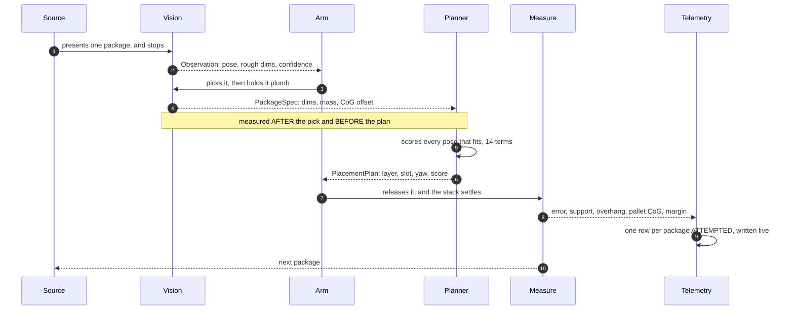
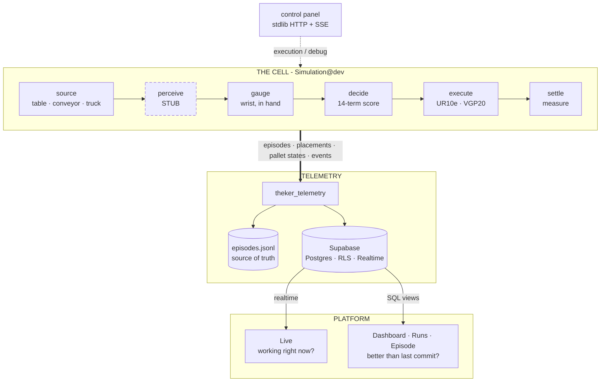

<div align="center">


**A robotic arm that stacks pallets without tipping them over — and the instrumentation that proves it.**

[](https://github.com/STACKSPECT/.github/blob/main/LICENSE)
[](https://github.com/STACKSPECT/Platform/actions/workflows/ci.yml)
[](https://mujoco.org)
[](https://www.python.org)
[](https://supabase.com)
[](https://nextjs.org)

`THEKER Robotics challenge` · `HackSpain '26`

<picture>
  <source media="(prefers-reduced-motion: reduce)" srcset="https://raw.githubusercontent.com/STACKSPECT/.github/main/img/simulation-cell.png">
  
</picture>

<sub>One episode, ×10. Truck source, empty pallet to full, nothing cut from the middle.</sub>

</div>

---

A palletizing cell that closes the loop. The arm sees the package a source presents, picks it,
**weighs it in its own wrist**, and only then decides where it goes — scoring every pose that
fits by support, by trapped air, and by where it leaves the combined centre of gravity. Then it
places it and watches the stack settle. Around it runs an observability platform, so that *"is
this commit better than the last one?"* has an answer that is a number.

**The cell runs** — three sources, nine levels, a full 1200 × 800 mm europallet. What is **not**
real is perception: the detector still reads the simulator's ground truth.

> The work is on **[`Simulation@dev`](https://github.com/STACKSPECT/Simulation/tree/dev)** —
> that repository's `main` is still the earlier skeleton, so links point at `dev`.

## The three repositories

| Repo | What lives there | Where it is |
|---|---|---|
| [**Simulation**](https://github.com/STACKSPECT/Simulation/tree/dev) | **The real cell, and the bulk of the project.** UR10e + suction, three sources, CoG-aware planner, depth-camera pallet survey, MuJoCo. | 🟢 **Closed loop, running.** 250 checks green, [158 of 165 packages placed](#measured-not-claimed) across 27 episodes. **Perception is the one stub left.** |
| [**Platform**](https://github.com/STACKSPECT/Platform) | Observability — Supabase schema, the `theker_telemetry` SDK, a Next.js interface with four screens. | 🟢 **Running**, on real measured episodes. 101 backend checks green. |
| [**Guionized-simulation**](https://github.com/STACKSPECT/Guionized-simulation) | The predecessor: a scripted pallet build with a Franka Emika Panda. The slot assignment comes out of a YAML file; the physics does not. | 🟢 **Done, and superseded.** It fixed the contract with the platform. [Its numbers are below](#the-baseline-it-had-to-clear). |

The scripted build existed so the platform received genuine episodes before anything could
produce them for the right reasons. `Simulation` now sends the same rows for the right reasons,
and the platform did not have to change to receive them.

<table>
<tr>
<td width="50%" align="center">

<br><sub><b>Then.</b> A Panda, a 210 × 140 mm model pallet, and a plan written by hand in YAML.</sub>
</td>
<td width="50%" align="center">

<br><sub><b>Now.</b> A UR10e, a full europallet, and a plan nobody wrote down in advance.</sub>
</td>
</tr>
</table>

## Built on

<div align="center">

<sub><b>THE CELL</b> — contacts and friction, so the release, the settle and the shake are simulated rather than assumed</sub>

[](https://mujoco.org) [](https://github.com/kevinzakka/mink) [](https://github.com/qpsolvers/qpsolvers) [](https://github.com/darnstrom/daqp)

<sub><b>THE PLANNER</b> — fourteen weights in YAML, not in code; it imports numpy and nothing else, and a test enforces it</sub>

[](https://www.python.org) [](https://numpy.org) [](https://scipy.org) [](https://pyyaml.org) [](https://docs.pytest.org)

<sub><b>THE PLATFORM</b> — Supabase <i>is</i> the backend, with no server of our own in between</sub>

[](https://supabase.com) [](https://www.postgresql.org) [](https://nextjs.org) [](https://react.dev) [](https://www.typescriptlang.org) [](https://docs.python.org/3/library/http.server.html)

</div>

## The cycle, in the order it happens



Measuring **after** the pick and **before** the plan is what forces the planner to be
incremental: it cannot lay out the pallet in advance, because it does not know what the next
package is until the arm is holding it.

## What is real, and what is still a stub

Every stage shipped an oracle stub reading ground truth, so the loop could run end to end
before any stage was real. Three of four have been replaced. A run is flagged `oracle` if
**any** stub remains — so every run today is still flagged, honestly.

| Stage | Stub → Real | State |
|---|---|---|
| **Perceive** | `OracleDetector` → `CameraDetector` | ⬜ **Not written.** `observe()` raises `NotImplementedError`. This is what keeps `oracle` true |
| **Gauge** | `OracleGauge` → `WristGauge` | ✅ **Real.** Force/torque at the wrist, one plumb reading · `--no-oracle-gauge` |
| **Pallet survey** | ground truth → three depth cameras | ✅ **Real.** Renders depth, unprojects, fuses · `--no-oracle-heightmap` |
| **Decide** | `GridPlanner` → `BeamPlanner` | ✅ **Real.** The beam search is what the numbers below are measured with (`--beam-planner`); the score heuristic is the CLI default and the grid filler the floor, and [both are reported beside it](#three-planners-one-method) |

`oracle` is computed from which pieces were selected, never written by hand. The platform
refuses to compare an oracle run against a measured one — that is exactly the comparison that
would invalidate the work.

## The cell

**Universal Robots UR10e** on a pedestal with an **OnRobot VGP20** 16-cup vacuum gripper —
1300 mm reach, 12.5 kg payload, a 2.55 kg tool, so **8.5 kg** is the ceiling on a carton. The
arm comes from MuJoCo Menagerie, but the kinematic chain is assembled in the repo rather than
included wholesale, so the cell can be an industrial bay instead of Menagerie's empty floor.

Three sources, three tiers each — **nine levels**, declared in YAML, not in code:

| Source | What it does | N1 · N2 · N3 |
|---|---|---|
| **Table** | Packages sit ready. Nothing moves until the arm does | one type aligned · mixed and rotated · sorted, adversarial CoG |
| **Conveyor** | A physical belt runs the package to the station and stops. *Stopped* means measured rest, not a fixed wait | centred on the belt · off-centre arrival · variable spacing |
| **Truck** | The trailer hands over the **whole load at once**. The only carton the arm may take is the one holding nothing up — recomputed each cycle by measuring the scene, not read from the loading plan | tidy columns · with the loader's mess · sorted, adversarial CoG |

A jam is reported as `timeout`, never as a source-specific failure: the vocabulary is closed
and a source has no event of its own. Getting that wrong rejects the row and silently kills
telemetry for the rest of the run.

## The control panel

<div align="center">

</div>

Pick a level, press play, rewind. Two centre-of-mass markers, deliberately: **the real ones
MuJoCo integrates, and the ones the robot computed**, error drawn between them. The mode
selector is the part that matters — **Execution** calls the real entrypoint and may publish
telemetry; **Debug** opens no episode and uploads nothing, and says so on its own badge. A demo
that quietly writes to the production database poisons the benchmark it exists to show.

## Measured, not claimed

Nine levels × three seeds, on `Simulation@dev` at **`6724d81`**, the real **beam search**
(`--beam-planner`), `--no-telemetry`, measured off the simulator's own state.

Two columns because the arm has two honest modes, and conflating them would flatter it. In
fast-forward it jumps between waypoints — release, settling and shake are simulated the same,
the transit is not. With motion interpolated, every millimetre is integrated.

| | fast-forward | motion interpolated |
|---|---|---|
| | `--level N -n 3 --beam-planner` | `… --beam-planner --speed 1` |
| Episodes completed | **25 / 27** | **22 / 27** |
| Packages placed | **158 / 165** · 96 % | **141 / 165** · 85 % |
| Placement error — mean · p95 · max | 2.5 · 3.8 · 5.1 mm | 3.1 · 4.5 · 9.7 mm |
| Placements resting fully supported | 67 % | 66 % |
| Stability margin, worst case | **+48 mm** | **+47 mm** |
| Margin ever negative | never | never |
| Dominant failure | `stack_collapse` 1, `wrong_placement` 1 | **`stack_collapse`** — 3 of 5 |

By tier, the shape is what you would want it to be — the easy levels are solved and the hard
ones are the frontier:

| | N1 — one type, aligned | N2 — mixed, rotated | N3 — sorted, adversarial CoG |
|---|:--:|:--:|:--:|
| fast-forward | 9 / 9 | 8 / 9 | 8 / 9 |
| motion interpolated | 9 / 9 | 7 / 9 | 6 / 9 |

Every failure came out of the closed vocabulary below. Not one run invented a cause.

### Three planners, one method

The cell ships three, and the honest way to show what the search buys is to run all of them
over the same nine levels and the same three seeds. **The interpolated column is the one that
counts** — it is the one where the arm actually travels:

| motion interpolated | grid baseline | score heuristic | **beam search** |
|---|---:|---:|---:|
| Episodes completed | 12 / 27 | 14 / 27 | **22 / 27** |
| Packages placed | 90 · 55 % | 112 · 68 % | **141 · 85 %** |
| `stack_collapse` failures | 12 | 9 | **3** |
| Stability margin, worst case | +28 mm | +53 mm | +47 mm |

And the reason to distrust fast-forward is in the gap between the two modes. In fast-forward
the grid baseline looks like the *best* of the three — 160 of 165 packages, more than the beam
search places. Let the arm actually travel and it loses 70 of them. A planner that only stacks
well when nothing is allowed to disturb the stack has not solved the problem; it has solved a
picture of it.

The beam search pays for its completion rate in two places, and both are visible above: it
places a little less precisely (3.1 mm mean against the heuristic's 2.6) and it rests fewer
packages on solid ground (66 % against 73 %), because it deliberately bridges gaps the
heuristic refuses. It also runs a tighter worst-case margin, +47 mm against +53 mm. Never
negative, in any planner, in any mode.

### What the belt was costing

Five commits back, at `ebad291`, the conveyor did not hand the carton over properly: the
station sat at the downstream lip, so a carton stopped with **40 to 205 mm of it in the air**.
Running the beam search at *both* commits, same levels, same seeds, isolates what that cost:

| motion interpolated | `ebad291` | `6724d81` |
|---|---:|---:|
| Episodes completed | 20 / 27 | **22 / 27** |
| Packages placed | 128 · 78 % | **141 · 85 %** |
| `stack_collapse` failures | 5 | **3** |
| Worst *landed* placement error, fast-forward | 16.0 mm | **5.1 mm** |

Thirteen more packages survive to the end of an episode, and the worst landed placement on the
page went from 16.0 mm to 5.1 mm. `tests/test_cell.py` now asserts every belt delivery lands
fully supported, so the mechanism cannot come back unnoticed.

**What real transit still costs is visible in the same table, and it is worth saying plainly.**
Between the two arm modes the beam search loses 3 episodes and 17 packages, its mean placement
error loosens from 2.5 mm to 3.1 mm and its worst case from 5.1 mm to 9.7 mm, and every one of
its five interpolated failures but two is a `stack_collapse`. The belt is no longer the cause
of those; the remaining collapses are on table and truck levels. Moving the arm for real is
still the hardest thing the cell does — it is simply no longer the belt's fault.

<details>
<summary><b>The planner earns its keep</b> — against a first-fit baseline</summary>

A separate harness, inside `tools/`: ten permutations of the reference scenario, seed 17. It
pits the **beam search** against a first-fit built by crippling that same planner — beam width
1, no lookahead, every weight zeroed — so the only variable is the search. Both place every
package, so completion is not the interesting number:

| | first-fit | beam search |
|---|---:|---:|
| Stacks that are strictly stable | 50 % | **100 %** |
| Mean CoM offset from the pallet centre | 142 mm | **81 mm** |

Reproduced unchanged at `6724d81`: the placement package is pure geometry and these five
commits did not touch it. And the weights are the knobs, not the code. Sweeping the one that
pulls the stack's centre of gravity toward the middle of the pallet, on level 11:

| `pallet_com` | CoG offset | width used | margin |
|---|---|---|---|
| 0.0 | 287 mm | 0.65 / 1.20 m | 257 mm |
| 0.4 | 154 mm | 0.88 / 1.20 m | 216 mm |
| **0.8** | **10 mm** | **1.00 / 1.20 m** | **305 mm** |
| 1.5 | 91 mm | 1.11 / 1.20 m | 209 mm |

At zero, ties break on ascending x and half the europallet stays empty. Fourteen terms, all in
YAML, each with its measurement written beside it.

</details>

<details>
<summary><b>Weighing in the time you already have</b> — one plumb reading, not a four-pose sweep</summary>

The classic way to find a package's centre of mass is to tilt the wrist through several poses
until gravity stops hiding a direction. The cell does not buy that. Held plumb, the two
*horizontal* components of the CoM fall straight out of the torque — no approximation — and the
blind direction is the vertical one, which **nothing downstream reads**: the stability check
accumulates moments in X and Y, the tipping margin is a distance in the contact plane, and the
cost function looks at the stack's CoG in plan.

Measured at `6724d81`, same level and seed, the only change being the number of poses:

| | 4-pose sweep | one plumb reading |
|---|---:|---:|
| Cell time per package | 5.29 s | **3.95 s** |
| Packages placed | 6 / 6 | 6 / 6 |
| Pallet CoG offset | 34 mm | 34 mm |
| Pallet fill | 0.483 | 0.483 |
| Mean planner score | 0.7933 | 0.7938 |

Same pallet, 25 % less cell time. The method keeps a tell-tale: the SVD hands back the blind
axis for free, and if the tool is not plumb enough that the axis still points somewhere
harmless, the reading is flagged unreliable and the slow sweep is still there for that one
package. Written up in
[`pesaje-en-el-sitio.md`](https://github.com/STACKSPECT/Simulation/blob/dev/pesaje-en-el-sitio.md).

</details>

<a id="the-baseline-it-had-to-clear"></a>
<details>
<summary><b>The baseline it had to clear</b> — the scripted predecessor</summary>

<table>
<tr>
<td width="46%" align="center">

<br><sub>Overhead — fill, overhang and CoG live in this view</sub>
</td>
<td width="54%" align="center">

<br><sub>Elevation — flatness and layers live in this one</sub>
</td>
</tr>
</table>

10 boxes, 2 layers, a 210 × 140 mm pallet — a 1:5.7 model of a Euro pallet, because the Panda's
gripper opens 80 mm and a real pallet is ungraspable. **No planner earned this plan**: which
box goes where is written out in
[`configs/pallet.yaml`](https://github.com/STACKSPECT/Guionized-simulation/blob/main/configs/pallet.yaml).

| | |
|---|---:|
| Placed | 10 / 10 |
| Placement error, mean · max | 2.6 mm · 5.7 mm |
| Flatness of the top layer | 0.1 mm |
| Maximum overhang | 0.2 mm |
| CoG to the pallet centre | 2.2 mm |
| Stability margin at the end | +58 mm |
| Pallet fill | 77 % |
| Duration | 204 s simulated |

That was the floor to clear, on a puzzle solved by hand, off-line, knowing every box in
advance. The planner has none of that — and on a pallet more than thirty times the area it
holds the same millimetre-scale placement error and a margin that has not gone negative in 288
measured placements.

</details>

## Why the centre of gravity

A pallet that is full is not a pallet that is good. What decides whether the load survives the
forklift is where the combined centre of gravity sits relative to the stack's support polygon —
a number that moves with every single box:

```
stability_margin  =  distance from the CoG to the nearest edge of the support polygon
                     negative  ->  it tips over
```

`stability_margin` and `support_polygon` are imported from the telemetry SDK and never
reimplemented. A third copy would eventually disagree with the one the interface draws.

<details>
<summary><b>Three details that each cost a lost run to learn</b></summary>

- **The margin is measured against the support polygon**, the envelope of the first layer's
  footprints — not against the edge of the pallet. Against the pallet the numbers come out
  optimistic and the screen says everything is fine right up until the collapse.
- **A box outside tolerance still counts.** It still has mass and still moves the centre of
  gravity. What does *not* count is the one left behind on the table: the test is geometric —
  does its footprint touch the pallet? — not "did the manoeuvre fail?"
- **One trace row per package *attempted*,** including the one that brought the stack down.
  Emit only the successes and the graph ends green on an episode that collapsed, destroying the
  one thing it exists for: letting you see the failure coming several placements early.

</details>

## Architecture



The dependency runs one way only. The cell imports the telemetry SDK; the platform does not
know MuJoCo exists, so rewriting the simulation never takes observability down with it. The
`jsonl` on disk stays the source of truth: if the venue wifi dies mid-demo, the benchmark keeps
running.

The same rule holds one level down: the placement heuristic imports numpy and nothing else,
enforced by an assertion rather than by convention — the self-check's very first test is that
no heavy module has crept into `sys.modules`. That is what lets the weights be tuned in
milliseconds instead of minutes, and one convenience import would end it.

## The platform

Four screens over the same pallet drawing; what changes is which episode it points at.

| Screen | What it answers |
|---|---|
| **Dashboard** | How each task has evolved, level by level — a card per level, and a fixed *at a glance* column carrying the verdict |
| **Episode** | One finished run, taken apart: top view with support polygon and CoG marker, elevation at the real pallet size, KPI grid, and the error of every placement in mm and degrees |
| **Runs** | Engineering. Every execution with its commit, level, seed range and arm speed, a success sparkline, the dominant failure cause, and a comparator between two commits — which **blocks** rather than renders when the two do not measure the same thing, naming which of the four conditions tripped |
| **Live** | The same dashboard following the episode running now, four KPIs readable from three metres away. It never goes blank and never lies: with nothing running it says so rather than backfilling the last episode, and on a dropped connection it freezes the last frame and says that too |

<picture>
  <source media="(prefers-color-scheme: dark)" srcset="https://raw.githubusercontent.com/STACKSPECT/.github/main/img/episode-dark.png">
  
</picture>

A pretty chart built on an invalid delta is exactly what a demo must not produce — hence the
refusal below, in red, instead of a plausible-looking comparison.

<picture>
  <source media="(prefers-color-scheme: dark)" srcset="https://raw.githubusercontent.com/STACKSPECT/.github/main/img/runs-dark.png">
  
</picture>

<sub>Captured at 1440 px from real runs; both screens follow your theme, and so do the images.
The interface is in Spanish.</sub>

## Under the hood

<details>
<summary><b>What we measure</b> — the metric reference</summary>

| Metric | Unit | Definition |
|---|---|---|
| `stability_margin` | mm | CoG to the nearest edge of the support polygon. **Negative = it tips over** |
| `cog_offset_xy` | mm | CoG of the load to the centre of the pallet |
| `support_ratio` | 0–1 | fraction of the package base resting on something solid |
| `overhang` | mm | how far the most protruding package sticks out of the pallet |
| `fill_ratio` | 0–1 | occupied volume over the bounding volume of the load |
| `settle_drift` | mm | how much the stack moved between release and rest |
| `layer_flatness` | mm | how far from level the top course sits |
| `cycle_time_s` | s | `duration_s / n_placed` — the number a real plant understands |

SI units in the database, millimetres and degrees in the event payloads and on screen, and the
unit is always printed next to the number. That inconsistency is deliberate and written down,
because it is the one that most easily slips through.

</details>

<details>
<summary><b>How it can fail</b> — the closed vocabulary</summary>

Eight causes, validated by the SDK. Anything else raises, on purpose — adding a ninth means
touching three places in the platform, so it is a conversation, not a commit.

| enum | on screen |
|---|---|
| `no_detection` | it saw no package |
| `ik_unreachable` | it cannot reach the position |
| `collision` | it hit something |
| `grasp_slip` | it slipped out of the gripper |
| `wrong_placement` | it left it out of tolerance |
| `timeout` | it ran out of time |
| `stack_collapse` | the stack collapsed |
| `overhang_violation` | it left the package off the pallet |

Two more closed vocabularies sit beside it: six event kinds, and four snapshot views. Invent a
value in any of the three and nothing fails where you wrote it — the row is rejected later, and
telemetry stays off for the rest of the run.

</details>

<details>
<summary><b>The numbers that were measured, not chosen</b></summary>

Every odd constant in the configuration carries its measurement beside it. A sample:

| Value | Setting | Why that number |
|---|---|---|
| 20 mm | `reach_tolerance` | above the servo's measured floor |
| 1.5 mm | `cup_gap` | pad to cardboard at the moment of seal |
| 40 mm | `clearance` | between boxes in a course; at 20 mm they rubbed |
| 1.70 m | belt length | 0.35 m beyond the station — the rotated half-footprint of the longest carton (0.55 m at 30° = 0.328 m), so the carton stops **fully supported** instead of 40–205 mm in the air |
| −0.80 m | belt offset in y | the same set-back the table got. Centred, a longer belt slid under the near pallet corner and the edge IK sweep went from 32/180 unsolvable poses to 37/180 |
| 0.60 / 0.15 m/s | transit / approach speed | **half** the original. At the old speeds, with motion interpolated, level 11 placed one carton of four and died on `ik_unreachable` |
| 0.55 m | `max_stack_height` | as high as the IK sweep validates — and also the *scale* of the `lowness` term. Using the paper figure of 1.35 m dilutes that gradient 3.4× and the heuristic builds towers instead of filling courses |
| 0.74 × 0.88 m | reachable bay | 0 of 720 swept poses out of reach |
| 8.5 kg | max carton | 12.5 kg payload − 2.55 kg of tool, with margin |
| 93.3 % | camera coverage of an empty pallet | *not* the ~98 % that would justify trusting unobserved cells, so `allow_unobserved` stays on — and says so |

Two inherited Panda numbers survive, both inside the placement package, and both are known: the
reach figures — which is why the reach filter is switched **off** rather than lying, and why the
planner can still pick a slot the UR10e cannot get to — and one weight swept on a smaller
pallet. Switching the filter on is a measurement and three numbers, not a rewrite.

</details>

<details>
<summary><b>How it is checked</b> — 250 green, in ascending order of cost</summary>

| Command | What it proves | Count |
|---|---|---|
| `python -m placing` | The heuristic alone — no simulator, no network. First check is the import boundary | 15 |
| `python tests/test_pallet.py` | Row keys match their columns, `seq` never repeats, vocabularies hold, and the three adapter translations that fail silently: yaw in radians, height above the deck, the pallet frame | 23 |
| `python -m src.measure` | The measurement itself: CoG with out-of-tolerance boxes, margin against the support polygon | ✅ |
| `python tests/test_cell.py` | Physics: all three sources compile, the cameras exist, the belt settles **and delivers every package fully supported**, the truck always presents the highest carton, the IK envelope, the wrist gauge recovering mass and planar CoG | 12 |
| `cd tools && uv run pytest` | The demonstrator survives the move | 200 |
| | | **250** |

The platform is checked separately: `pytest` in `Platform/backend` gives **101 passed, 19
skipped** — the skips need a live database.

Both were run here, against `Simulation@dev` `6724d81` and `Platform@dev` `4071e46`, to produce
every number on this page.

</details>

<details>
<summary><b>Licensing and provenance</b></summary>

The UR10e model derives from MuJoCo Menagerie under BSD-3-Clause; attribution is in the
repository's `THIRD_PARTY_NOTICES.md`. `qpsolvers` is LGPL-3.0, used as a library and not
redistributed here. Dependencies are pinned with `==` throughout: what resolves today has to
resolve the same way on the night of a demo.

</details>

---

<div align="center">

<sub>Built for the <b>THEKER Robotics</b> challenge at <b>HackSpain '26</b> by
<a href="https://github.com/manuamest">José Manuel Amestoy</a>
<!-- add the rest of the team here --></sub>

<sub>MIT throughout —
<a href="https://github.com/STACKSPECT/.github/blob/main/LICENSE">this repository</a> ·
<a href="https://github.com/STACKSPECT/Simulation/blob/main/LICENSE">Simulation</a> ·
<a href="https://github.com/STACKSPECT/Platform/blob/main/LICENSE">Platform</a> ·
<a href="https://github.com/STACKSPECT/Guionized-simulation/blob/main/LICENSE">Guionized-simulation</a></sub>

</div>
